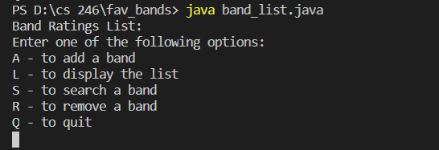

## Overview
This program will create a list of name and gives options to add to the list, remove from the list, and to display the list. This is to show my ability to use ArrayList, Loops and conditionals.

### Enviorment:
I used visual studio code with java and git downloaded

##### Running the Program:
I simpy inputed "java band_list.java" into the terminal and it displayed the results.

##### Screenshot:

##### Helpful Websites: 
I found w3school.com to be extremely helpful, escpecially their pages on formatting.
https://beginnersbook.com/2013/12/java-arraylist/